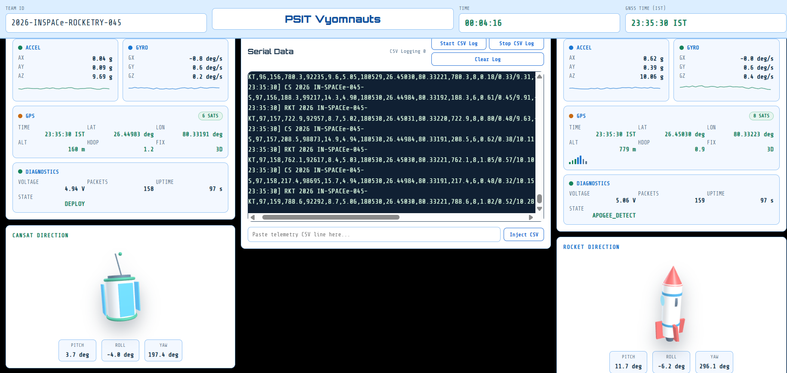
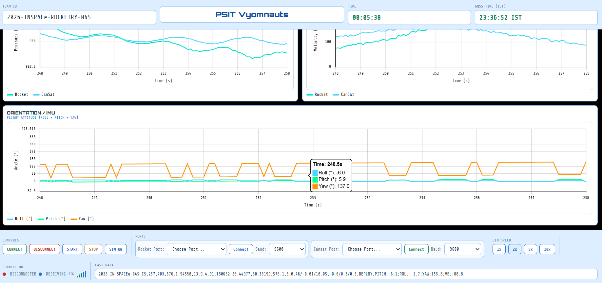

# 🚀 Rocket Ground Control Station (GCS)

## Overview
This project is a web-based Ground Control Station (GCS) developed for monitoring Rocket and CanSat telemetry. The current version demonstrates the complete dashboard using simulated (dummy) telemetry data for testing and visualization.

## Features

- 🚀 Real-time Rocket and CanSat monitoring dashboard
- 📡 Dual communication ports (Rocket & CanSat)
- ⚙️ Independent baud rate configuration for both communication ports
- 🗺️ GPS map visualization using Leaflet and OpenStreetMap
- 📈 Real-time telemetry graphs:
  - Velocity vs Time
  - Altitude vs Time
  - Pressure vs Time
  - Temperature vs Time
- 🌡️ Live gauges for:
  - Altitude
  - Pressure
  - Temperature
  - Speed
- 📍 Distance calculation between Rocket, CanSat and Ground Station
- 🛰️ GPS information display
- 📊 Accelerometer and Gyroscope sensor monitoring
- 📝 Serial data console
- 💾 CSV data logging (Start/Stop Log)
- ⏱️ Mission timer
- 📱 Responsive dashboard interface

## Technologies Used

- HTML
- CSS
- JavaScript
- Leaflet.js
- OpenStreetMap

## Dashboard Screenshots

### Main Dashboard

### Telemetry Dashboard

### Graphs and Sensors

### Communication & Logging

## Future Improvements

- Integration with real Rocket telemetry
- LoRa/XBee communication
- Live GPS tracking
- Data recording and analysis
- Flight replay functionality
